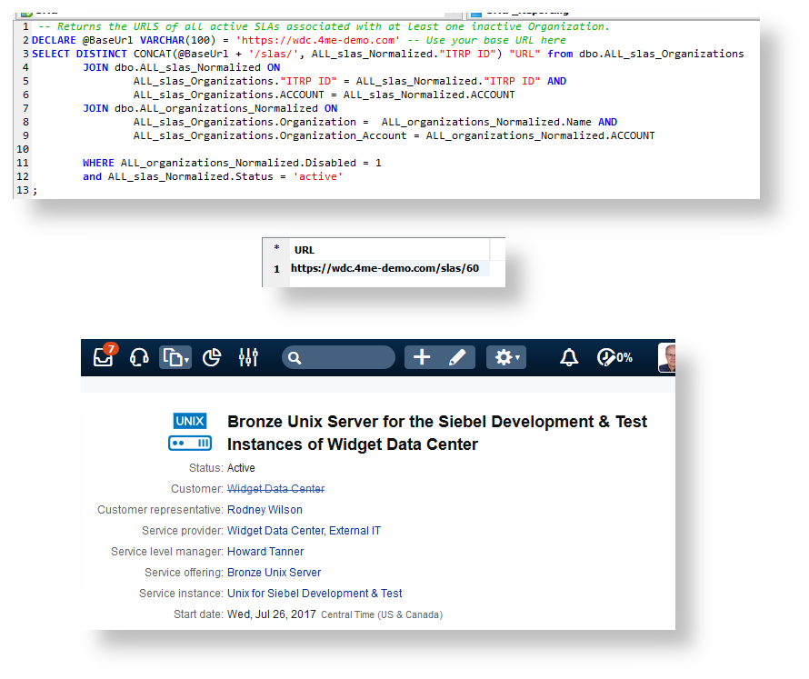

# 4me reporting scripts
Utility and helper scripts for the [4me](https://4me.com) enterprise service management system.
Requires the reporting database from [techwork](https://www.techwork.at).

## Overview
4me provides many reports and statistics, but it can still be difficult to find inconsistencies among records, for instance if deactivated users are still entered as Change Managers or SLAs contain inactive Service Offerings.
These SQL scripts help find these inconsistencies.
Connect to your techwork reporting database, adapt the script for your URL and run the statements to try it out. They will print out URLs of records that you  can paste into a browser and fix the records there.

## [Change Templates.sql](https://github.com/apa-it/4me-Reporting-Scripts/blob/master/Change%20Templates.sql)
The statements in this file help you find Change Templates with inconsistencies. See the comments inside the file for details.

## [Products.sql](https://github.com/apa-it/4me-Reporting-Scripts/blob/master/Products.sql)
The statements in this file help you find Products with inconsistencies. See the comments inside the file for details.

## [Service Instances.sql](https://github.com/apa-it/4me-Reporting-Scripts/blob/master/Service%20Instances.sql)
The statements in this file help you find Service Instances with inconsistencies. See the comments inside the file for details.

## [SLAs.sql](https://github.com/apa-it/4me-Reporting-Scripts/blob/master/SLAs.sql)
The statements in this file help you find SLAs with inconsistencies. See the comments inside the file for details.

### All active SLAs where the Customer field is set to an inactive Organization.
When an organization is disabled in 4me it is difficult to find SLAs associated with it: Organization records do not have a **Relations** section, and the SLA list does not allow filtering for disabled Organizations.
This statement will return all SLAs with disabled Customers.

## [Users.sql](https://github.com/apa-it/4me-Reporting-Scripts/blob/master/Users.sql)
The statements in this file will generate a list of URLs of all the records linked to specific users. These users can be all the disabled users in the system or a specific list of users.

1. Add users to the ``#tmp`` table with the *Specific Users* and *All Disabled Users* statements.
2. Change the ``@BaseUrl`` variable to your 4me domain.
3. Run the large *Main* statement to generate the URLs of all records linked to the users in the ``#tmp`` table.
4. Run the cleanup statement to remove the ``tmp`` table if necessary, and go back to step 1.
